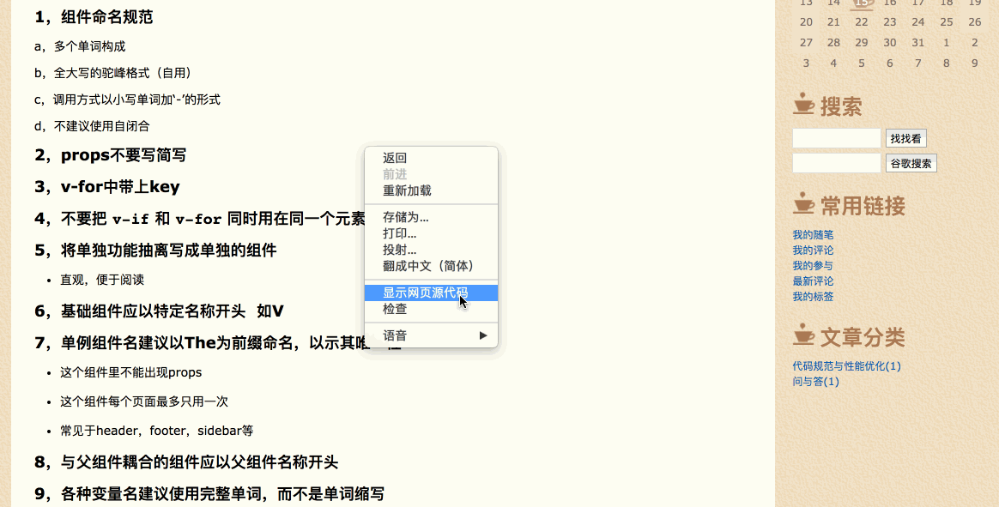
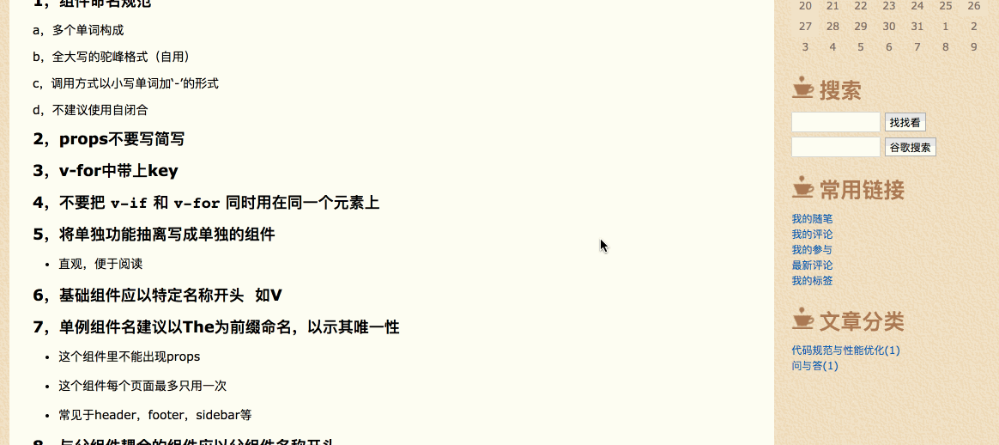
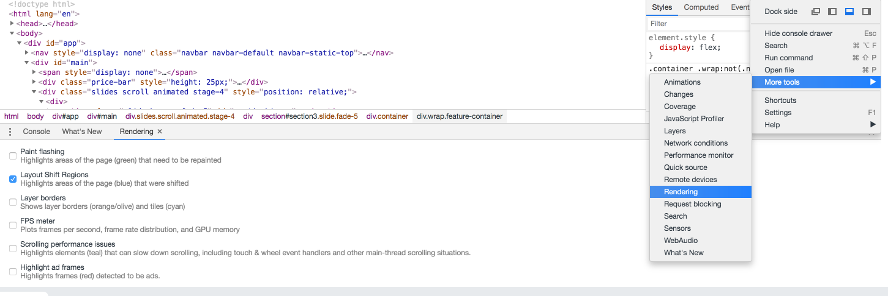

# css小特性

> 海纳百川，有容乃大；壁立千仞，无欲则刚

### 01. 选中高亮样式



### 02. 识别页面结构脚本

```js
(function(){
  var style = document.querySelector('#_outline_');
  if (style) {
    style.parentNode.removeChild(style);
  } else {
    style = document.createElement('style');
    style.id = '_outline_';
    style.innerHTML = "*{outline: 1px solid red}";
    document.body.appendChild(style);
  }
})();
```



### 03. writing-mode竖排版


- vertical-rl
- vertical-lr

```html
<div class="container">
  <div class="vertical-text">
    <h3>虞美人</h3>
    <h4>南唐·李煜</h4>
    <p>春花秋月何时了？往事知多少。<br>小楼昨夜又东风，<br>故国不堪回首月明中。<br>雕栏玉砌应犹在，只是朱颜改。<br>问君能有几多愁？<br>恰似一江春水向东流。</p>
  </div>
</div>
```

```css
.container {
  width: 100vw;
  height: 100vh;
  display: flex;
  justify-content: center;
  align-items: center;
}
.vertical-text {
  writing-mode: vertical-rl;
  h3 {
    padding-left: 10px;
    font-weight: bold;
    font-size: 18px;
    color: $red;
  }
  h4 {
    padding-left: 20px;
    font-weight: bold;
    font-size: 12px;
    color: $orange;
  }
  p {
    line-height: 30px;
    color: $purple;
  }
}
```

### 04. 文本两端对齐


- text-align-last:justify

### 05. 单行文本省略号

```css
  overflow: hidden;
  text-overflow: ellipsis;
  white-space: nowrap;
```

### 06. 倒序文本


- letter-spacing

> letter-spacing最少是font-size的2倍

```css
  font-weight: bold;
  font-size: 90px;
  color: red;
  transform: translateX(90px);
  letter-spacing: -180px;
```

### 07. transform开启GPU硬件加速

- 用法： transform: translateZ(0)
- 使用原因： 有时执行动画可能会导致页面卡顿，可在特定元素中使用硬件加速来避免这个问题

##### 开启GPU硬件加速的坑

> 使用3D硬件加速提升动画性能时，最好给元素增加一个z-index属性，人为干扰复合层的排序，可以有效减少chrome创建不必要的复合层，提升渲染性能，移动端优化效果尤为明显。

```css
  position: relative;
  z-index: 1;  // 可以设大点，尽量设得比后面元素的z-index值高
```

##### 打开复合层的方法



### 08. iOS overflow-scrolling弹性滚动

> iOS页面非body元素的滚动操作会非常卡(Android不会出现此情况)，通过overflow-scrolling:touch调用Safari原生滚动来支持弹性滚动，增加页面滚动的流畅度

```css
body {
  -webkit-overflow-scrolling: touch;
}
.elem {
  overflow: auto;
}
```

### 09. pointer-events禁用事件触发

- pointer-events: none
