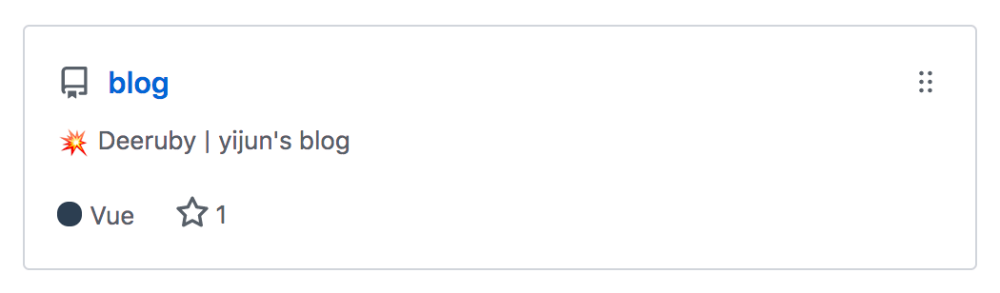

# 玩转Github

### 语言识别错误

在根目录建立 `.gitattributes` 文件，对识别错误的语言进行如下设置:

```*.sh linguist-language=Vue```

<p style="color: #2c3e50; font-size: 20px;">效果如下:</p>



### markdown中的小标签生成

* [github标签生成](https://shields.io)

<p style="color: #2c3e50; font-size: 20px;">效果如下:</p>


